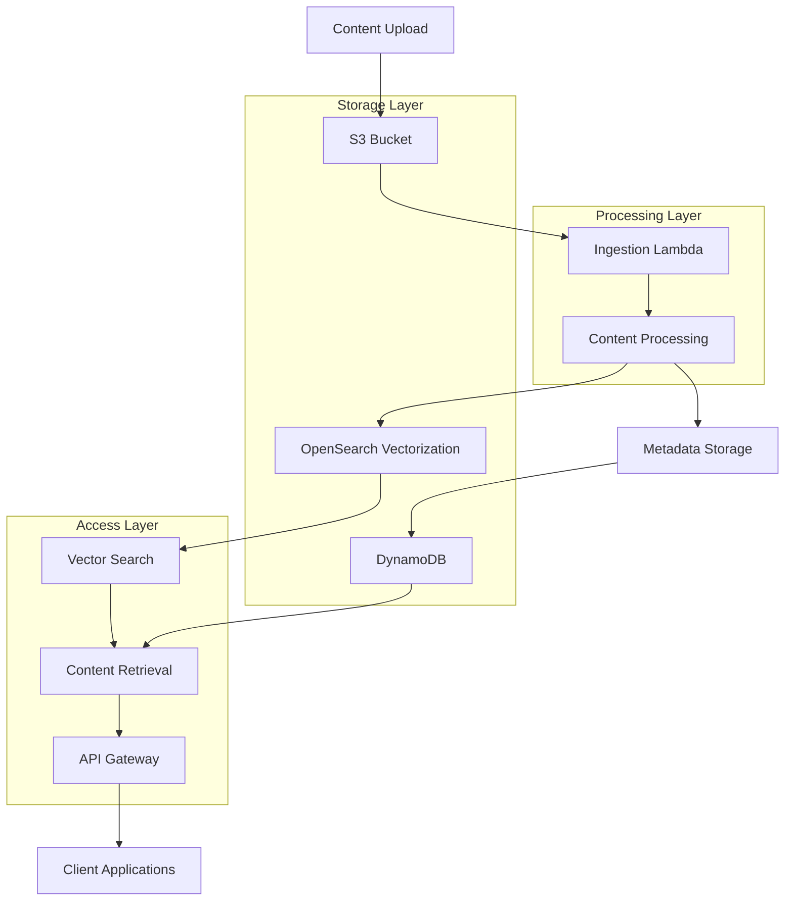

# Content Management System Design

## Overview

The content management system provides a robust backend infrastructure for ingesting, processing, storing, and retrieving certification study materials. The system leverages AWS serverless technologies to create a scalable, cost-effective solution that can handle various content types while providing semantic search capabilities and progress tracking.

The design builds upon the existing ProCert infrastructure, enhancing it with structured content management, improved metadata handling, and user progress tracking capabilities.

## Architecture

### High-Level Architecture



### Data Flow

1. **Content Ingestion**: Study materials uploaded to S3 trigger processing
2. **Content Processing**: Lambda extracts, validates, and structures content
3. **Vector Storage**: Processed content stored in OpenSearch with embeddings
4. **Metadata Storage**: Structured metadata and relationships stored in DynamoDB
5. **Content Retrieval**: API provides search and access to processed content
6. **Progress Tracking**: User interactions recorded for analytics and personalization

## Components and Interfaces

### 1. Content Ingestion Service

**Purpose**: Handles upload and initial processing of study materials

**Components**:
- S3 bucket with event notifications
- Ingestion Lambda function (enhanced from existing)
- Content validation and format detection

**Interfaces**:
```python
class ContentIngestionService:
    def process_upload(self, bucket: str, key: str) -> ProcessingResult
    def validate_content(self, content: bytes) -> ValidationResult
    def extract_metadata(self, content: bytes, format: str) -> ContentMetadata
```

**Enhancements to Existing System**:
- Add content type detection and validation
- Extract structured metadata (questions, answers, categories)
- Implement error handling and retry logic
- Add content versioning support

### 2. Content Processing Engine

**Purpose**: Transforms raw content into structured, searchable format

**Components**:
- Text extraction and chunking (existing)
- Question/Answer extraction
- Category and topic classification
- Content relationship mapping

**Interfaces**:
```python
class ContentProcessor:
    def extract_questions_answers(self, text: str) -> List[QuestionAnswer]
    def classify_content(self, text: str) -> ContentClassification
    def chunk_content(self, text: str) -> List[ContentChunk]
    def generate_embeddings(self, chunks: List[str]) -> List[Embedding]
```

### 3. Storage Management

**Purpose**: Manages data persistence across multiple storage systems

**S3 Storage**:
- Certification-specific buckets (e.g., procert-materials-saa, procert-materials-dva)
- General documentation bucket (procert-materials-general)
- Raw content files with certification metadata tags
- Processed content artifacts
- Backup and versioning

**OpenSearch Storage**:
- Vector embeddings for semantic search
- Content chunks with metadata
- Search indices and mappings

**DynamoDB Storage**:
- Content metadata and relationships
- User progress and interactions
- System configuration and settings

**Interfaces**:
```python
class StorageManager:
    def store_content_metadata(self, metadata: ContentMetadata) -> str
    def store_vector_embeddings(self, embeddings: List[VectorDocument]) -> bool
    def store_user_progress(self, user_id: str, progress: ProgressData) -> bool
    def retrieve_content_by_id(self, content_id: str) -> ContentDocument
```

### 4. Search and Retrieval Service

**Purpose**: Provides intelligent content discovery and retrieval

**Components**:
- Vector similarity search (existing, enhanced)
- Metadata-based filtering
- Hybrid search combining vector and keyword search
- Result ranking and relevance scoring

**Interfaces**:
```python
class SearchService:
    def semantic_search(self, query: str, filters: Dict) -> List[SearchResult]
    def get_related_content(self, content_id: str) -> List[ContentDocument]
    def search_by_category(self, category: str) -> List[ContentDocument]
    def get_user_recommended_content(self, user_id: str) -> List[ContentDocument]
```

### 5. Progress Tracking Service

**Purpose**: Monitors and records user learning progress

**Components**:
- Interaction logging
- Progress calculation
- Performance analytics
- Recommendation engine data

**Interfaces**:
```python
class ProgressTracker:
    def record_interaction(self, user_id: str, content_id: str, interaction: InteractionData) -> bool
    def get_user_progress(self, user_id: str) -> UserProgress
    def calculate_completion_rate(self, user_id: str, category: str) -> float
    def get_performance_analytics(self, user_id: str) -> PerformanceMetrics
```

## Data Models

### Content Metadata Model
```python
@dataclass
class ContentMetadata:
    content_id: str
    title: str
    content_type: str  # 'question', 'study_guide', 'practice_exam'
    certification_type: str  # 'AWS-SAA', 'AWS-DVA', 'AWS-SOA', 'general'
    category: str
    subcategory: Optional[str]
    difficulty_level: str
    tags: List[str]
    created_at: datetime
    updated_at: datetime
    version: str
    source_file: str
    source_bucket: str  # Track which bucket (certification-specific vs general)
    chunk_count: int
    question_count: Optional[int]
```

### Question-Answer Model
```python
@dataclass
class QuestionAnswer:
    question_id: str
    content_id: str
    question_text: str
    answer_options: List[str]
    correct_answer: str
    explanation: Optional[str]
    category: str
    difficulty: str
    tags: List[str]
```

### User Progress Model
```python
@dataclass
class UserProgress:
    user_id: str
    content_id: str
    progress_type: str  # 'viewed', 'answered', 'completed'
    score: Optional[float]
    time_spent: int  # seconds
    timestamp: datetime
    session_id: str
```

### Vector Document Model
```python
@dataclass
class VectorDocument:
    document_id: str
    content_id: str
    chunk_index: int
    text: str
    vector_embedding: List[float]
    certification_type: str  # Critical for RAG filtering
    metadata: Dict[str, Any]  # Includes source_file, category, tags
```

## Error Handling

### Content Processing Errors
- **Invalid Format**: Return structured error with supported formats
- **Extraction Failure**: Log error, attempt alternative extraction methods
- **Embedding Generation Failure**: Retry with exponential backoff
- **Storage Failure**: Implement transaction rollback and cleanup

### Search and Retrieval Errors
- **OpenSearch Unavailable**: Fallback to cached results or basic search
- **DynamoDB Throttling**: Implement retry with jitter
- **Invalid Query**: Return user-friendly error messages

### Progress Tracking Errors
- **Duplicate Interactions**: Implement idempotency keys
- **Data Consistency**: Use conditional writes and optimistic locking

## Testing Strategy

### Unit Testing
- Content extraction and validation logic
- Embedding generation and storage
- Search query construction and result processing
- Progress calculation algorithms

### Integration Testing
- End-to-end content ingestion workflow
- Search functionality across storage systems
- Progress tracking data consistency
- API endpoint functionality

### Performance Testing
- Content processing throughput
- Search response times
- Concurrent user load handling
- Storage system scalability

### Security Testing
- Access control validation
- Data encryption verification
- Input sanitization testing
- API authentication and authorization

## Implementation Considerations

### Scalability
- Lambda concurrency limits for processing
- OpenSearch cluster sizing and sharding
- DynamoDB read/write capacity planning
- S3 request rate optimization

### Security
- IAM roles with least privilege access
- Encryption at rest and in transit
- API authentication and rate limiting
- Content access control and user permissions

### Monitoring and Observability
- CloudWatch metrics for all services
- Distributed tracing for request flows
- Error alerting and notification
- Performance monitoring and optimization

### Cost Optimization
- S3 lifecycle policies for content archival
- OpenSearch reserved capacity planning
- DynamoDB on-demand vs provisioned capacity
- Lambda memory and timeout optimization