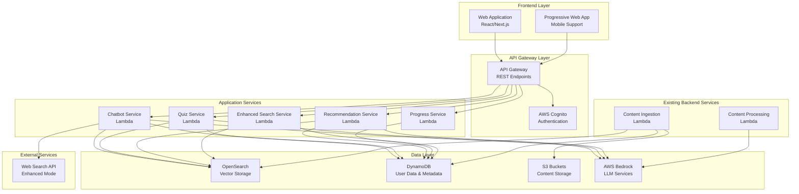

# Learning Platform Design Document

## Overview

The ProCert Learning Platform is a comprehensive web-based application that transforms the existing content management backend into an interactive learning experience. The platform leverages the established AWS infrastructure (OpenSearch, DynamoDB, Bedrock, API Gateway) while adding new components for user authentication, web interface, quiz generation, and personalized learning paths.

The design follows a microservices architecture with clear separation between the existing content management services and new learning-focused services, ensuring scalability and maintainability.

## Architecture

### High-Level Architecture



### Service Architecture Patterns

**Dual-Mode Response System:**
- **RAG-Only Mode**: Primary mode using curated content from OpenSearch
- **Enhanced Mode**: Supplements RAG with real-time web search when needed
- **Intelligent Routing**: Automatically determines when to escalate to enhanced mode

**Event-Driven Processing:**
- User interactions trigger progress tracking events
- Quiz completions generate recommendation updates
- Performance analytics calculated asynchronously

**Caching Strategy:**
- User session data cached in memory
- Frequently accessed content cached at API Gateway level
- Recommendation results cached with TTL

## Components and Interfaces

### 1. Enhanced Chatbot Service

**Purpose**: Provides intelligent conversational interface with dual-mode responses

**Key Features:**
- RAG-only responses using curated certification materials
- Enhanced mode with web search integration
- Conversation context management
- Source citation and transparency
- Certification-specific filtering

**API Endpoints:**
```
POST /api/chat/message
- Body: { "message": string, "certification": string?, "mode": "rag"|"enhanced"?, "conversation_id": string? }
- Response: { "response": string, "sources": array, "mode_used": string, "conversation_id": string }

GET /api/chat/conversation/{id}
- Response: { "messages": array, "metadata": object }

DELETE /api/chat/conversation/{id}
- Response: { "success": boolean }
```

**Implementation Details:**
- Extends existing chatbot Lambda with enhanced capabilities
- Maintains conversation state in DynamoDB with TTL
- Integrates with web search API for enhanced mode
- Uses prompt engineering to distinguish between content sources

### 2. Quiz Generation Service

**Purpose**: Creates dynamic practice quizzes from extracted Q&A content

**Key Features:**
- Generates quizzes from existing extracted questions
- Adaptive difficulty based on user performance
- Immediate feedback with explanations
- Performance tracking and analytics
- Anti-repetition logic

**API Endpoints:**
```
POST /api/quiz/generate
- Body: { "certification": string, "difficulty": string?, "count": number?, "user_id": string }
- Response: { "quiz_id": string, "questions": array, "metadata": object }

POST /api/quiz/submit
- Body: { "quiz_id": string, "answers": array, "user_id": string }
- Response: { "score": number, "results": array, "feedback": array }

GET /api/quiz/history/{user_id}
- Response: { "quizzes": array, "statistics": object }
```

**Implementation Details:**
- New Lambda function with DynamoDB integration
- Uses existing QuestionAnswer data from content processing
- Implements spaced repetition algorithm for question selection
- Tracks user performance patterns for adaptive difficulty

### 3. Recommendation Engine

**Purpose**: Provides personalized study recommendations based on user performance

**Key Features:**
- Performance-based weak area identification
- Content difficulty progression recommendations
- Study path optimization
- Achievement and milestone tracking

**API Endpoints:**
```
GET /api/recommendations/{user_id}
- Query: certification?, limit?
- Response: { "recommendations": array, "reasoning": array }

POST /api/recommendations/feedback
- Body: { "user_id": string, "recommendation_id": string, "action": string }
- Response: { "success": boolean }

GET /api/study-path/{user_id}/{certification}
- Response: { "path": array, "progress": object, "next_steps": array }
```

**Implementation Details:**
- New Lambda function with ML-based recommendation logic
- Analyzes user progress patterns from DynamoDB
- Uses content metadata for intelligent sequencing
- Implements collaborative filtering for similar user patterns

### 4. Progress Tracking Service

**Purpose**: Comprehensive user progress and performance analytics

**Key Features:**
- Real-time progress tracking
- Performance trend analysis
- Achievement system
- Study time optimization
- Certification readiness assessment

**API Endpoints:**
```
GET /api/progress/{user_id}
- Query: certification?, timeframe?
- Response: { "overall": object, "by_certification": object, "trends": array }

POST /api/progress/interaction
- Body: { "user_id": string, "content_id": string, "interaction_type": string, "data": object }
- Response: { "success": boolean }

GET /api/analytics/{user_id}
- Response: { "performance": object, "predictions": object, "recommendations": array }
```

**Implementation Details:**
- Extends existing progress tracking with enhanced analytics
- Real-time dashboard data aggregation
- Predictive analytics for certification readiness
- Integration with recommendation engine

### 5. User Authentication Service

**Purpose**: Secure user management and session handling

**Key Features:**
- AWS Cognito integration
- JWT token management
- Role-based access control
- Password reset and account management

**Implementation Details:**
- AWS Cognito User Pool for authentication
- API Gateway authorizers for endpoint protection
- User profile management in DynamoDB
- Session management with secure tokens

### 6. Web Application Frontend

**Purpose**: Modern, responsive web interface for all platform features

**Technology Stack:**
- **Framework**: Next.js 14 with React 18
- **Styling**: Tailwind CSS with custom design system
- **State Management**: Zustand for client state
- **API Integration**: React Query for server state
- **Authentication**: NextAuth.js with Cognito provider

**Key Components:**
- **Chat Interface**: Real-time messaging with typing indicators
- **Quiz Interface**: Interactive question presentation with immediate feedback
- **Dashboard**: Progress visualization with charts and metrics
- **Study Path**: Guided learning progression interface
- **Profile Management**: User settings and preferences

## Data Models

### Enhanced User Profile
```typescript
interface UserProfile {
  user_id: string;
  email: string;
  name: string;
  target_certifications: string[];
  study_preferences: {
    daily_goal_minutes: number;
    preferred_difficulty: string;
    notification_settings: object;
  };
  created_at: string;
  last_active: string;
}
```

### Conversation Context
```typescript
interface ConversationContext {
  conversation_id: string;
  user_id: string;
  messages: Array<{
    role: 'user' | 'assistant';
    content: string;
    timestamp: string;
    sources?: string[];
    mode_used?: 'rag' | 'enhanced';
  }>;
  certification_context?: string;
  created_at: string;
  ttl: number; // DynamoDB TTL
}
```

### Quiz Session
```typescript
interface QuizSession {
  quiz_id: string;
  user_id: string;
  certification: string;
  questions: Array<{
    question_id: string;
    question_text: string;
    options: string[];
    correct_answer: string;
    user_answer?: string;
    explanation: string;
  }>;
  status: 'in_progress' | 'completed';
  score?: number;
  started_at: string;
  completed_at?: string;
}
```

### Study Recommendation
```typescript
interface StudyRecommendation {
  recommendation_id: string;
  user_id: string;
  type: 'content' | 'quiz' | 'review';
  priority: number;
  content_id?: string;
  reasoning: string;
  estimated_time: number;
  created_at: string;
  expires_at: string;
}
```

## Error Handling

### Error Classification
- **User Errors**: Invalid input, authentication failures
- **System Errors**: Service unavailability, timeout errors
- **Data Errors**: Inconsistent state, validation failures
- **External Errors**: Web search API failures, Bedrock throttling

### Error Response Format
```json
{
  "error": {
    "code": "ERROR_CODE",
    "message": "Human-readable error message",
    "details": {},
    "timestamp": "2025-01-01T00:00:00Z",
    "request_id": "uuid"
  }
}
```

### Fallback Strategies
- **Chatbot**: Graceful degradation from enhanced to RAG-only mode
- **Quiz**: Use cached questions if real-time generation fails
- **Recommendations**: Provide generic recommendations if personalized fails
- **Progress**: Continue tracking with eventual consistency

## Testing Strategy

### Unit Testing
- **Service Logic**: Jest/Vitest for business logic testing
- **API Endpoints**: Supertest for endpoint testing
- **Data Models**: Validation and serialization testing
- **Frontend Components**: React Testing Library

### Integration Testing
- **Service Integration**: Test service-to-service communication
- **Database Integration**: Test DynamoDB and OpenSearch operations
- **Authentication Flow**: Test Cognito integration
- **External APIs**: Mock web search API responses

### End-to-End Testing
- **User Journeys**: Playwright for complete user workflows
- **Performance Testing**: Load testing for API endpoints
- **Security Testing**: Authentication and authorization testing
- **Cross-browser Testing**: Ensure compatibility across browsers

### Testing Data Management
- **Test Fixtures**: Standardized test data for consistent testing
- **Database Seeding**: Automated test data setup and teardown
- **Mock Services**: Mock external dependencies for isolated testing
- **Environment Isolation**: Separate test environments for different test types

## Security Considerations

### Authentication & Authorization
- **JWT Tokens**: Secure token-based authentication
- **Role-Based Access**: Different access levels for users and admins
- **Session Management**: Secure session handling with proper expiration
- **API Rate Limiting**: Prevent abuse and ensure fair usage

### Data Protection
- **Encryption at Rest**: All data encrypted in DynamoDB and S3
- **Encryption in Transit**: HTTPS/TLS for all communications
- **PII Handling**: Minimal PII collection with proper anonymization
- **Data Retention**: Automated cleanup of expired data

### Input Validation
- **API Input Validation**: Comprehensive validation at API Gateway
- **SQL Injection Prevention**: Parameterized queries and ORM usage
- **XSS Prevention**: Input sanitization and output encoding
- **CSRF Protection**: CSRF tokens for state-changing operations

### Infrastructure Security
- **IAM Least Privilege**: Minimal required permissions for each service
- **VPC Security**: Network isolation where appropriate
- **Secrets Management**: AWS Secrets Manager for sensitive configuration
- **Audit Logging**: Comprehensive logging for security monitoring

## Performance Optimization

### Caching Strategy
- **API Gateway Caching**: Cache frequently accessed endpoints
- **Application-Level Caching**: Redis for session and recommendation caching
- **CDN Integration**: CloudFront for static asset delivery
- **Database Query Optimization**: Efficient DynamoDB query patterns

### Scalability Considerations
- **Lambda Concurrency**: Appropriate concurrency limits and scaling
- **DynamoDB Scaling**: On-demand billing with burst capacity
- **OpenSearch Scaling**: Appropriate instance sizing and sharding
- **API Gateway Throttling**: Rate limiting to prevent overload

### Monitoring & Observability
- **CloudWatch Metrics**: Custom metrics for business KPIs
- **Distributed Tracing**: X-Ray for request tracing across services
- **Error Tracking**: Centralized error logging and alerting
- **Performance Monitoring**: Real-time performance dashboards

## Deployment Strategy

### Infrastructure as Code
- **CDK Enhancement**: Extend existing CDK stack with new resources
- **Environment Management**: Separate stacks for dev/staging/prod
- **Resource Tagging**: Consistent tagging for cost allocation
- **Rollback Strategy**: Automated rollback on deployment failures

### CI/CD Pipeline
- **GitLab CI Enhancement**: Extend existing pipeline for frontend
- **Automated Testing**: Run full test suite before deployment
- **Blue-Green Deployment**: Zero-downtime deployments
- **Feature Flags**: Gradual feature rollout and A/B testing

### Monitoring & Alerting
- **Health Checks**: Automated health monitoring for all services
- **Performance Alerts**: Proactive alerting on performance degradation
- **Error Rate Monitoring**: Alert on elevated error rates
- **Business Metrics**: Track user engagement and learning outcomes