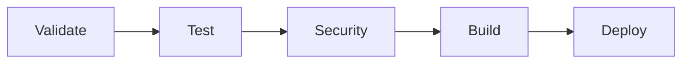

# GitLab Setup Guide for ProCert (Intern Project)

## Overview

This is a simplified GitLab setup guide tailored for intern projects using a single AWS account. This setup focuses on learning DevOps practices while keeping complexity manageable.

## Prerequisites

- Access to AWS internal GitLab (https://gitlab.aws.dev)
- Single AWS account with admin access
- Basic knowledge of Git and AWS
- AWS SSO/credentials for GitLab authentication

## Quick Start

### 1. Access Your Existing GitLab Repository

You already have a GitLab repository set up at:
**https://gitlab.aws.dev/ymarouaz/ProCert**

This is perfect for your intern project as it's:
- ✅ Already created and configured
- ✅ On AWS's internal GitLab instance
- ✅ Properly secured within AWS infrastructure

### 2. Repository Migration

The migration script is already configured for your AWS GitLab repository:

```bash
# The script is pre-configured for your repository
GITLAB_URL="https://gitlab.aws.dev"
GITLAB_PROJECT="ymarouaz/ProCert"
```

Run the migration:

```bash
./scripts/migrate_to_gitlab.sh
```

### 3. Configure CI/CD Variables

Go to your GitLab project → Settings → CI/CD → Variables and add:

#### Required Variables

| Variable | Value | Settings |
|----------|-------|----------|
| `AWS_ACCESS_KEY_ID` | Your AWS access key | ✅ Protected, ✅ Masked |
| `AWS_SECRET_ACCESS_KEY` | Your AWS secret key | ✅ Protected, ✅ Masked |
| `AWS_ACCOUNT_ID` | Your AWS account ID (12 digits) | ✅ Protected |

**Security Note**: Use an IAM user with minimal required permissions, not your root account!

### 4. Create IAM User for GitLab

For security, create a dedicated IAM user for GitLab CI/CD:

```bash
# Create IAM user
aws iam create-user --user-name gitlab-ci-procert

# Create access key
aws iam create-access-key --user-name gitlab-ci-procert

# Attach necessary policies
aws iam attach-user-policy --user-name gitlab-ci-procert --policy-arn arn:aws:iam::aws:policy/PowerUserAccess
```

**Alternative**: Create a custom policy with only the permissions you need:

```json
{
    "Version": "2012-10-17",
    "Statement": [
        {
            "Effect": "Allow",
            "Action": [
                "cloudformation:*",
                "s3:*",
                "dynamodb:*",
                "lambda:*",
                "iam:*",
                "opensearch:*",
                "apigateway:*",
                "logs:*"
            ],
            "Resource": "*"
        }
    ]
}
```

## Simplified CI/CD Pipeline

The pipeline has been simplified for intern projects:



### Pipeline Stages

1. **Validate**: Code linting and CDK syntax validation
2. **Test**: Unit tests and integration tests
3. **Security**: Basic security scanning
4. **Build**: Package Lambda functions
5. **Deploy**: Deploy to your AWS account (manual trigger)

### Key Features

- **Single environment**: Everything deploys to your AWS account
- **Manual deployment**: You control when deployments happen
- **Security scanning**: Learn about security best practices
- **Test coverage**: See how well your code is tested

## Branch Strategy (Simplified)

For an intern project, use a simple branch strategy:

- **`main`**: Stable code that can be deployed
- **`feature/*`**: Feature development branches
- **`fix/*`**: Bug fix branches

### Workflow

1. Create feature branch: `git checkout -b feature/new-feature`
2. Make changes and commit
3. Push branch: `git push origin feature/new-feature`
4. Create merge request in GitLab
5. Review and merge to `main`
6. Deploy manually from `main` branch

## Learning Opportunities

This setup provides hands-on experience with:

### DevOps Practices
- ✅ Version control with Git
- ✅ CI/CD pipelines
- ✅ Infrastructure as Code (CDK)
- ✅ Automated testing
- ✅ Security scanning

### AWS Services
- ✅ CloudFormation (via CDK)
- ✅ Lambda functions
- ✅ DynamoDB
- ✅ S3
- ✅ OpenSearch
- ✅ API Gateway

### Software Engineering
- ✅ Code quality (linting, formatting)
- ✅ Unit testing
- ✅ Integration testing
- ✅ Code coverage
- ✅ Documentation

## Cost Management

Since this is an intern project on a personal AWS account:

### Free Tier Resources
- Lambda: 1M requests/month free
- DynamoDB: 25GB storage free
- S3: 5GB storage free
- API Gateway: 1M requests/month free

### Cost Monitoring
1. Set up AWS Budgets with alerts
2. Use AWS Cost Explorer to track spending
3. Clean up resources when not needed

### Resource Cleanup Script

```bash
#!/bin/bash
# cleanup.sh - Clean up AWS resources to save costs

echo "Cleaning up ProCert resources..."

# Destroy CDK stack
cdk destroy --all --force

echo "Cleanup completed!"
```

## Troubleshooting

### Common Issues

#### 1. Pipeline Fails with AWS Credentials Error
**Solution**: 
- Verify CI/CD variables are set correctly
- Check IAM user has necessary permissions
- Ensure variables are marked as "Protected"

#### 2. CDK Bootstrap Fails
**Solution**:
```bash
# Bootstrap manually first
cdk bootstrap aws://YOUR_ACCOUNT_ID/us-east-1
```

#### 3. Lambda Deployment Timeout
**Solution**: 
- Check Lambda function size
- Verify dependencies are correctly packaged
- Increase timeout in CDK stack

#### 4. DynamoDB Access Denied
**Solution**:
- Verify IAM permissions include DynamoDB
- Check table names match environment variables

### Debug Commands

```bash
# Test CDK locally
cdk synth --all
cdk diff

# Test Lambda functions locally
cd lambda_src
python main.py

# Check AWS credentials
aws sts get-caller-identity

# View CloudFormation events
aws cloudformation describe-stack-events --stack-name ProcertInfrastructureStack
```

## Best Practices for Interns

### 1. Security
- ✅ Never commit AWS credentials to Git
- ✅ Use IAM users, not root account
- ✅ Enable MFA on your AWS account
- ✅ Regularly rotate access keys

### 2. Code Quality
- ✅ Write meaningful commit messages
- ✅ Add comments to complex code
- ✅ Write tests for new features
- ✅ Keep functions small and focused

### 3. Documentation
- ✅ Update README when adding features
- ✅ Document API endpoints
- ✅ Explain complex business logic
- ✅ Keep architecture diagrams current

### 4. Learning
- ✅ Read pipeline logs to understand what's happening
- ✅ Experiment with different AWS services
- ✅ Ask questions about unfamiliar concepts
- ✅ Document what you learn

## Next Steps

1. **Set up the repository** following this guide
2. **Run your first pipeline** and watch it work
3. **Make a small change** and see it deploy
4. **Explore GitLab features** like issues and merge requests
5. **Add monitoring** to see how your application performs

## Resources for Learning

- [GitLab CI/CD Tutorial](https://docs.gitlab.com/ee/ci/quick_start/)
- [AWS CDK Workshop](https://cdkworkshop.com/)
- [AWS Free Tier Guide](https://aws.amazon.com/free/)
- [Python Testing Best Practices](https://realpython.com/python-testing/)

## Getting Help

If you run into issues:

1. **Check the pipeline logs** in GitLab
2. **Look at AWS CloudFormation events** in the console
3. **Search for error messages** online
4. **Ask your mentor** or team lead
5. **Create an issue** in GitLab to track problems

Remember: Making mistakes is part of learning! Don't be afraid to experiment and break things - that's how you learn to fix them. 🚀